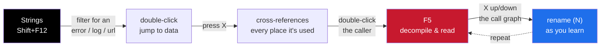
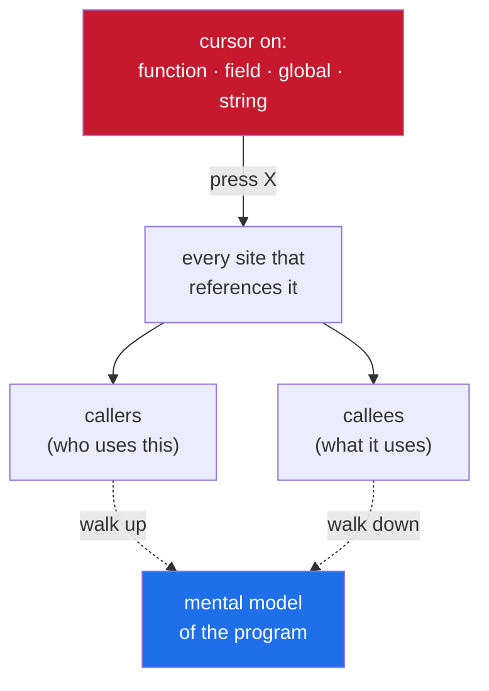
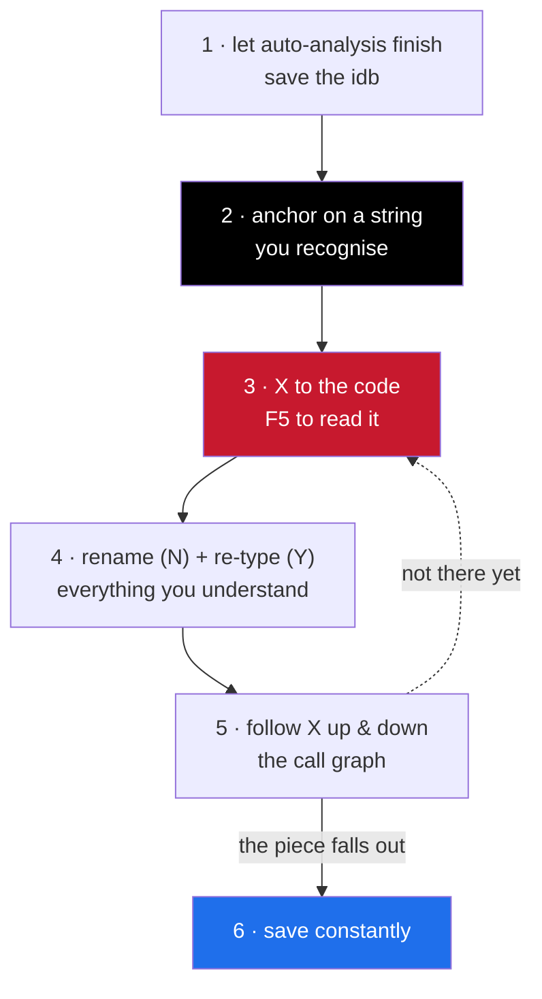

<h1 align="center">ida-pro-guide</h1>

<p align="center">a practical guide to using ida pro — what the windows do, how to read disassembly, and how to actually get around a binary</p>

<p align="center">
  
  
  
</p>

---

ida pro drops you into a huge disassembled binary with no map. this is how to stop
staring at it and start reading it — the windows that matter, the keys you'll
actually use, and the handful of moves that get you from "where do i even start" to
"here's the function i wanted."

---

## contents

- [opening a binary](#opening-a-binary)
- [the windows you actually use](#the-windows-you-actually-use)
- [the keys that matter](#the-keys-that-matter)
- [the core loop: anchor, then walk](#the-core-loop-anchor-then-walk)
- [reading pseudocode without trusting it blindly](#reading-pseudocode-without-trusting-it-blindly)
- [making sense of a function fast](#making-sense-of-a-function-fast)
- [cross-references are the whole game](#cross-references-are-the-whole-game)
- [patching and scripting](#patching-and-scripting-when-you-need-them)
- [a sane workflow](#a-sane-workflow)

---

## opening a binary

drag it in. ida asks about the file type — for a compiled program just take the
default it detected (Mach-O, PE, ELF) and let it run **auto-analysis**. the status
bar at the bottom shows it working; wait for it to finish before you judge anything,
because half-analysed code looks like garbage.

what it produces is a `.idb` (or `.i64` for 64-bit) — your database. it holds every
name, comment and type you add.

> **save often** (`Ctrl+W`). ida does not auto-save.

---

## the windows you actually use

| window | key | what it's for |
|--------|-----|---------------|
| **IDA View-A** | — | the disassembly, the main screen. `Space` flips linear ↔ graph view |
| **Pseudocode** | `F5` | decompiles a function to c-like code — where you'll live |
| **Functions** | `Ctrl+F` | every function down the left; filter to find one |
| **Strings** | `Shift+F12` | every string in the binary — your best way in |
| **Imports / Exports** | — | library calls it makes, and what it exposes |
| **Hex View** | — | raw bytes, synced to your cursor |

assembly is for when the decompiler lies or gives up. the rest of the time you read
pseudocode.

---

## the keys that matter

| key | does |
|-----|------|
| `F5` | decompile the current function to pseudocode |
| `Space` | toggle graph ↔ linear disassembly |
| `Tab` | jump between disassembly and its pseudocode |
| `N` | rename whatever's under the cursor (function, variable, label) |
| `X` | show **cross-references** — everywhere this is used/called |
| `Ctrl+X` | xrefs *from* here |
| `;` | add a repeatable comment |
| `G` | go to an address |
| `Esc` / `Ctrl+Enter` | back / forward, like a browser |
| `Y` | set a variable or function's type |
| `Shift+F12` | strings window |

> `X` and `N` are the two you'll lean on hardest: **follow references**, and
> **rename** things the moment you understand them so the next pass reads in english.

---

## the core loop: anchor, then walk

you almost never start at the function you want. you start at a **string** you can
recognise and walk to it.



1. open **Strings** (`Shift+F12`), filter for something the code must print — an
   error message, a log line, a format string, a url.
2. double-click it to jump to where it lives in the data.
3. press `X` on it — that lists every place in the code that references that string.
   usually one of them is the function you're after.
4. double-click that reference, `F5` to decompile, and read.

from there you follow the call graph: `X` on a function shows its callers, and
double-clicking a called function walks you down into it. rename (`N`) as you go —
`sub_1809D34` becomes `loadstring_impl` and suddenly the surrounding code makes
sense.

---

## reading pseudocode without trusting it blindly

the decompiler is right most of the time and confidently wrong some of the time —
especially where auto-analysis didn't fully resolve types, or where an obfuscator
mangled control flow. two habits:

- when a variable is `v8` doing something opaque, click it and press `Y` to give it a
  type. the decompiler re-renders and often the mess becomes obvious.
- when the pseudocode looks impossible (a `BR` into nowhere, a jump table that
  doesn't add up), drop to the disassembly (`Tab`) and read the actual instructions.

> **the assembly never lies; the decompiler is an interpretation of it.**

names, types and comments you add all feed back into the decompiler, so the more you
annotate, the more readable every later `F5` becomes.

---

## making sense of a function fast

open it, `F5`, then:

- read the **arguments** and the **return** first — the signature tells you what it
  does before the body does.
- skim for **string references and called functions** with recognisable names
  (`malloc`, `memcpy`, a logging call) — they're landmarks.
- find the **branch that matters** — the `if` that gates the interesting path — and
  read that, not every line.
- rename the function (`N`) the second you can describe it in three words.

---

## cross-references are the whole game

reverse engineering is mostly answering **"what calls this?"** and **"what does this
touch?"**. `X` answers both.



a field, a function, a global, a string — put the cursor on it, press `X`, and ida
shows every site. that graph *is* the program's structure; following it is how you
build a mental model without reading all 2 million lines.

> **a real gotcha:** on big or stripped binaries, ida's auto-analysis sometimes
> **doesn't build every xref**. if `X` on something you *know* is used comes back
> empty, the reference is there but unrecognised (a computed address, a pointer in a
> table). fall back to scanning — search the bytes, or trace the data flow by hand —
> instead of trusting an empty xref list.

---

## patching and scripting (when you need them)

**patch bytes**
```
Edit → Patch Program → Assemble        (or Change byte)
Edit → Patch Program → Apply patches to input file   ← writes them out to disk
```
ida edits the *database* first; the second step is what actually changes the file.

**scripting**
```
Shift+F2                 quick IDC / Python line
File → Script file       a full script
```
the python api (`idautils`, `idc`, `ida_bytes`) automates the boring passes —
iterate every function, scan for a pattern, bulk-rename.

---

## a sane workflow



1. let auto-analysis finish. save the idb.
2. from **Strings**, anchor on something you recognise.
3. `X` to the code, `F5` to read it.
4. rename (`N`) and re-type (`Y`) everything you understand, as you understand it.
5. follow `X` up and down the call graph until the piece you want falls out.
6. save constantly.

that's the whole craft: anchor on a string, walk the references, annotate as you
learn, and lean on the decompiler while checking it against the disassembly when it
gets weird.

---

<p align="center">
  <sub><b>more from me:</b> <a href="https://github.com/shiedless/ios-ue4-re">ios-ue4-re</a> · <a href="https://github.com/shiedless/unity-il2cpp-esp-tutorial">unity-il2cpp-esp-tutorial</a> · <a href="https://github.com/shiedless/roblox-ios-luau-vm-notes">roblox-ios-luau-vm-notes</a> · <a href="https://github.com/shiedless/ios-messiah-re">ios-messiah-re</a> · <a href="https://github.com/shiedless/Reveal">Reveal</a></sub>
</p>

---

<p align="center">— shiedless</p>
